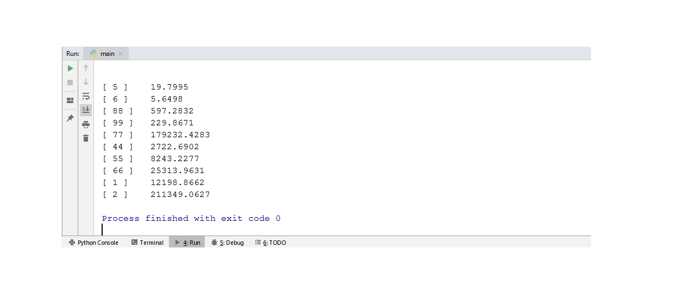

4. Имеется двумерный массив 10х2 в виде списка. Сделать консольную программу, которая вводит данные массива с клавиатуры, осуществляет заданый вариантом алгоритм и выводит получиенный список-результат на экран

